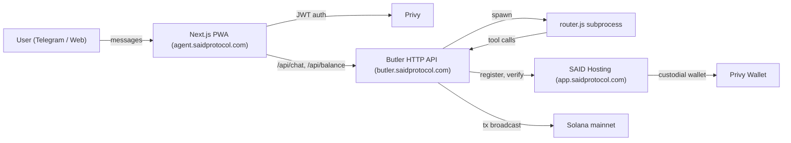

<div align="center">
  <h1>SAID Agent</h1>
  <p>
    
    
    
    
    
    
    
  </p>
  <p>
    <a href="https://agent.saidprotocol.com"></a>
    &nbsp;
    <a href="https://t.me/saidinfrabot"></a>
  </p>
</div>

---

The web surface for SAID Agent — a personal AI agent on Solana that lives in Telegram and your browser. Each user gets their own on-chain identity, a custodial Solana wallet, and a chat-driven interface for swaps, transfers, send-by-handle, portfolio, and more. **Multi-platform (Telegram + PWA), one identity, one balance, one chat.** Auth via Privy; identity anchored on the SAID Protocol; agent execution via a butler runtime backed by OpenClaw.

## Features

| | Feature | What it does |
|---|---|---|
| 🪪 | **On-chain identity** | Every agent has a verified SAID identity (mainnet Solana) — name, wallet, reputation anchors |
| 💬 | **Chat surface** | One conversation across Telegram and the web — same agent, same history |
| 🔐 | **Privy auth** | Login with Telegram, X, email, Google, or wallet — session shared across surfaces |
| 📲 | **Telegram Mini App** | Funding flow launches inside Telegram with auto-auth via WebApp initData |
| 💰 | **Solana wallet** | Custodial Privy-managed wallet — swaps, transfers, send-by-handle, staking |
| 👤 | **Send by @handle** | "Send 0.5 SOL to @joe" — recipient pre-provisioned if not yet a user |
| 📊 | **Portfolio** | Live balances, recent activity, anchored receipts |
| 🎁 | **Invites** | One-tap claim of crypto sent before signup |

<details>
<summary><strong>Architecture</strong></summary>

<br>



**Stack**

```
Next.js 16 (Turbopack)              — App router, server components
TypeScript 5 / Tailwind 4            — Strict types, utility CSS
@privy-io/react-auth (root + solana) — Auth, embedded wallets, fundWallet
@solana/web3.js / @solana/kit (v5)   — Chain interactions
Telegram WebApp SDK                  — Mini App context, initData
```

**Pages**

```
src/app/
├─ page.tsx              — Marketing landing (unauthed)
├─ chat/                 — Per-user chat with the agent
├─ portfolio/            — Balance + activity
├─ send/                 — Send-by-handle UI
├─ fund/                 — Generic fund-via-Privy
├─ fund-onramp/          — Telegram Mini App fund flow (auto-auth)
├─ activity/             — On-chain receipts
├─ launches/             — X-launch directory (public)
├─ agents/[platformId]/  — Public agent profiles
├─ adopt/                — Pre-provisioned recipient claim
├─ invite/[token]/       — Invite-link landing
└─ stats/                — Protocol stats
```

</details>

## Quick Start

**Prerequisites:** Node 22+, npm

```bash
git clone https://github.com/Jugmaster/said-agent-web.git
cd said-agent-web
npm install
npm run dev
```

Open [http://localhost:3000](http://localhost:3000).

> **Production:** `agent.saidprotocol.com` — Railway-hosted, auto-deploys from `main`.

## Configuration

Environment variables (`.env.local` for dev):

```bash
# Butler container HTTP API
NEXT_PUBLIC_BUTLER_API=https://butler.saidprotocol.com
# Solana RPC for client balance reads — set a real provider in prod; the public
# RPC default is rate-limited and can make balances read as empty/$0.
NEXT_PUBLIC_SOLANA_RPC=
# Server-side RPC for the /api/research route (falls back to the public RPC).
SOLANA_RPC=
```

The Privy app ID is currently hard-coded in `src/app/providers.tsx` (shared with `saidprotocol.com`).

## Companion Services

| Service | Repo | Role |
|---|---|---|
| **Butler API** | `Jugmaster/butler-container` | HTTP API, router subprocess, OpenClaw gateway, Telegram bot runtime |
| **SAID Hosting** | `SAID-Protocol/said-hosting` | Protocol API — register, verify, provision Privy wallets |
| **SAID Identity Program** | `SAID-Protocol/said` | On-chain Anchor program, mainnet |

## Important Notes

- **PWA + Telegram Mini App share the same Privy session** when launched from `@saidinfrabot`. The Mini App auto-authenticates via Telegram WebApp `initData` — no popup.
- **Agent wallets are custodial Privy wallets** provisioned by SAID Hosting. The PWA's logged-in Privy user is a separate identity that *owns* the agent via butler.db linkage.
- **Send-by-handle pre-provisions recipients** — if you send to `@bob` and Bob has never used the protocol, an agent is created for him and the funds are held in escrow until he claims.
- **AI agents can make mistakes.** Verify transactions before approving. Start with small amounts.

## Links

**Live App:** [agent.saidprotocol.com](https://agent.saidprotocol.com) · **Telegram:** [@saidinfrabot](https://t.me/saidinfrabot) · **Protocol:** [saidprotocol.com](https://www.saidprotocol.com) · **Twitter:** [@saidinfra](https://x.com/saidinfra)

---

<div align="center">
  <sub>Built on <a href="https://www.saidprotocol.com">SAID Protocol</a></sub>
</div>
